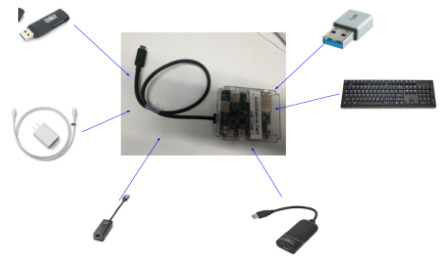
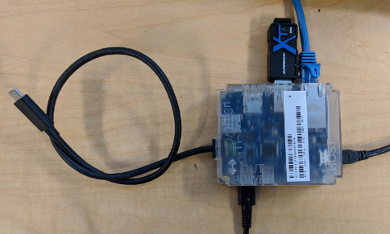
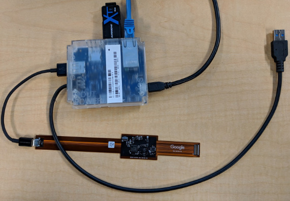

# Servo v4

Servo v4 is a debug device in the Servo family.

Servo v4 functions as a configurable USB hub to support developer and lab
recovery features. However, it doesn't have any hardware debug features on its
own. It must be paired with CCD (Cr50's on-board servo implementation) or
[Servo Micro].

[TOC]

*** note
**Googlers**: gLinux has a [kernel bug] that will cause all
USB devices (including keyboard and mouse) to randomly stop working when using
servo v4.

To enable tracing and help debug the issue, which also seems to help reduce the
frequency of occurrence, you can add the following to `/etc/rc.local`:

```bash
logger "Enabling USB Tracing: See http://b/123886969 and http://b/136676682"
echo 1 > /sys/kernel/debug/tracing/events/xhci-hcd/enable
```

See this [email][chatty-eng servo issue] for more details.
***

## What is Servo v4?

Servo combines the functionality of the following devices into one:

*   Ethernet-USB dongle
*   Muxable USB port
*   uSD to USB3.0 dongle
*   Keyboard emulator
*   Pass through charger

Details:

*   [Servo v4 Block Diagram]
*   [Servo v4 Schematic]



## Getting Servo v4

*** promo
Sorry, Servo v4 is not publicly available for purchase.
***

### Partners

Your contact at Google should be able to provide you with Servo v4.

### Googlers

Stop by your local Chromestop. You will need to
[update the firmware](#updating-firmware) before using, as the factory firmware
is quite old.

## How to Use Servo v4

Servo v4 can be plugged into a host machine using a uB USB cable. This will
power Servo v4 while allowing the user to control Servo v4 using [`servod`].

The DUT connector (which is a captive cable) can be plugged into a DUT,
providing the DUT access to the ethernet and blue USB port.

The Type-C captive cable enables debugging of devices that have a Cr50 (recent
Chromebooks) through [CCD].

The "uServo" USB port can be used to plug a servo micro to debug devices over
the Yoshi debug header.

From here other functionality is available. The following ports can be used to
download data to a device:

*   Ethernet
*   uSD card
*   USB stick

Additionally Servo v4 can be used to power the DUT which becomes useful for
devices that use USB as their only charge port (tablets, phones etc.). The
Type-C port can be used to plug in any Type-C charger to provide full charging
capabilities as a charge through hub. If no charger is plugged, Servo v4 will
act as a passive hub.

Servo v4 has an embedded keyboard so keystrokes can be emulated on the DUT.

The [`servod`] server must be running for Servo v4 to work. Details can be
found on the [Servo] page.

## Type-A vs Type-C Variants

There are two variants of Servo V4: Type-A and Type-C.

Both versions use the same board and case, but have a different captive cable
stuffed.

### Type-C Version

The Type-C version acts as both a USB hub and PD charger. Servo v4 can also
control both CC terminations which allows it to act as a debug accessory. It
should be used on systems with [CCD].

*** note
NOTE: Type-C Servo v4 is a charge-through hub and is NOT functionally equivalent
to a Type-A servo with an A-to-C adapter. DO NOT use a Type-C Servo v4 just
because you want to plug into a Type-C port. Older Chromebooks (Eve, Samus,
etc.) have [EC] bugs that prevent charge through hubs from working correctly.
***



### Type-A Version

The Type-A version is used with a uServo and serves as the DUT USB hub, with
the uServo providing SPI and UART support.



## Servo v4 Revisions

Servo v4 had several revisions, indicated by board color. The mass production
(MP) version is available from Chromestop.

### Green (MP)

Final version, has full functionality.

### Blue (DVT)

The DVT version is completely functional except for the one bug affecting only
Type-C variant. There are about one thousand of these, so you may encounter
them.

*   PD Charge-through only works on chargers up to 10V.
*   Firmware identifies this by board revision and will not negotiate any
    voltages above 10V.

### Red (EVT)

The EVT version is a mostly functioning version with a few bugs. There are
around three hundred of these total.

*   The ethernet IC has a bug in it that makes the device fall out of
    GigE/USB3.0 speeds under certain circumstances and it falls down to USB1.1 /
    2 speeds and never properly recovers until reset.
*   Type-C variant doesn't function, Type-A works OK.

## Software

Servo v4 runs more or less equivalently to Servo v2 and v3, through [`servod`].
It's intended to be mostly transparent, but there are some differences.

Most functionality is exported through `dut-control`.

```bash
(chroot) $ sudo servod -b <board> -s <serial>
```

To use with a specific board, you can connect a servo_micro to the "uServo"
labeled port (or use the Type-C cable to connect to [CCD]) and run [`servod`],
which will load the board config and control both Servo v4 and Servo Micro (or
Cr50).

```bash
(chroot) $ sudo servod -b [board] -s [serialno printed on servo v4 sticker]
```

### Recipes

#### Connect to Servo console without servod

Connect to Servo v4 Console:

```bash
(chroot) $ usb_console -d 18d1:501b
```

Connect to Servo Micro Console:

```bash
(chroot) $ usb_console -d 18d1:501a -i 3
```

Connect to Cr50 Console:

```bash
(chroot) $ usb_console -d 18d1:5014
```

#### Switch SD to Host

```bash
(chroot) $ dut-control sd_en:on sd_pwr_en:on sd_mux_sel:servo_sees_usbkey host_sd_usb_mux_en:on host_sd_usb_mux_sel:sd
```

#### Switch SD to DUT

```bash
(chroot) $ dut-control sd_en:on sd_pwr_en:on sd_mux_sel:dut_sees_usbkey
```

#### Disable SD

```bash
(chroot) $ dut-control sd_en:off sd_pwr_en:off
```

#### Switch USB3 to Host

```bash
(chroot) $ dut-control usb3_mux_en:on usb3_mux_sel:servo_sees_usbkey usb3_pwr_en:on host_sd_usb_mux_en:on host_sd_usb_mux_sel:usb
```

#### Switch USB3 to DUT

```bash
dut-control usb3_mux_en:on usb3_mux_sel:dut_sees_usbkey usb3_pwr_en:on
```

Recipes for Type-C (Using PD firmware)

*   Disable / Enable SuzyQ wiring / Debug accessory mode:
    *   `dut-control servo_v4_dts_mode:off [on]`
*   Disable / Enable Chargethrough:
    *   `dut-control servo_v4_role:snk [src]`

## Flashrom

*** note
For [CCD]: Flashrom doesn't need to specify voltage anymore, this is done
within Cr50. See the "care and feeding" for your specific device for the
correct `flashrom` commands for [CCD], Servo Micro, and Servo v2, as they are
each different.
***

*** note
When flashing the BIOS or EC with [CCD], you need to make sure the [`FlashAP`]
capability is enabled in Cr50.
***

Flash BIOS with CCD:

```bash
(chroot) $ sudo flashrom -p raiden_debug_spi:target=AP -r bios.bin
```

## Updating Firmware {#updating-firmware}

The latest firmware is available in the chroot at
`/usr/share/servo_updater/firmware/`.

If the green LED on the servo does not light up when DUT POWER is connected to a
USB charger, you probably don’t have the latest firmware and should update.

Note: [`servod`] must not be running.

Update to default firmware:

```bash
(chroot) $ sudo servo_updater -b servo_v4
```

Update to specific version:

```bash
(chroot) $ sudo servo_updater -b servo_v4 -f <filename>
```

## Enabling Case Closed Debug (CCD)

See [CCD] for complete details.


*** note
If using a Type-C Servo v4, these commands will only work if the USB-C cable is
plugged into the correct USB port. Generally, this is the USB port on the left
side of the device. If the command doesn't work, try the other ports.
***

Connect to Cr50 console:

```bash
(chroot) $ usb_console -d 18d1:5014
```

Check the Cr50 version in the Cr50 console:

```
> version
Build:   0.4.10/cr50_v1.9308_B.269-754117a
```

***note
CCD requires Cr50 version 0.3.9+ / 0.4.9+
*   0.4.x is the "pre-pvt" version, for pre-production devices.
*   0.3.x is the "mp" version, for production devices. This requires the device
    to be in developer mode before "ccd open".
*   0.0.22 is the factory preflash from GUC. It needs an update.
***

Open CCD in the Cr50 console:

```
> ccd open
```

Press power button when prompted. It should take around 5 minutes.

*** note
If you get an an access denied error when attempting `ccd open`, you likely do
not have developer mode enabled.
***

*** note
Cr50 loses the developer mode state after "opening CCD". If your device boots
into recovery mode, try re-entering developer  mode.
***

Enable testlab mode in the Cr50 console:

```
> ccd testlab enable
```

Press power button some more. CTRL+C to exit.

Run [`servod`] as normal, [CCD] should be enabled now.

## Known issues

*   Displayport - not supported
*   Type-A/Type-C: Servo V4 comes in two variants on the captive cable, both can
    be obtained from Chromestop.
*   Type-C Servo is not interchangeable with Type-A. Type-C must be paired with
    CCD, Type-A must be paired with Servo Micro.
*   DFU: To use util/flash_ec you must enable DFU by connecting servo with an
    A-A cable plugged into an OTG cable. USB ID is tied to BOOT0 indicator on
    the STM32 part.

## Bugs

File bug or feature requests [here][Bug].

## Programming

*** note
You don't need to do this unless you're developing Servo v4 firmware.
***

Servo v4 code lives in the [EC] and [`hdctools`] codebase. It can be built as
follows:

```bash
(chroot) $ cd ~/trunk/src/platform/ec
(chroot) $ make BOARD=servo_v4 -j8
```

To raw flash a Servo v4, `BOOT0` select pin is indicated by the OTG cable:

```bash
(chroot) $ ./util/flash_ec --board=servo_v4
```

To set the Servo v4 serial number on the Servo console:

```
> serialno set 012345
```

[Servo]: ./servo.md
[Servo v4 Block Diagram]: https://docs.google.com/drawings/d/1Ba0ut5-MeAOKpLQZ7nFbEaxFD_kFMGIIQmF6SxBUjc4/edit
[Servo v4 Schematic]: https://docs.google.com/a/chromium.org/viewer?a=v&pid=sites&srcid=Y2hyb21pdW0ub3JnfGRldnxneDo1ZmQ5NjFmMGZlZjFiYjk5
[Servo Micro]: ./servo.md
[EC]: https://chromium.googlesource.com/chromiumos/platform/ec
[`servod`]: ./servod.md
[SuzyQ]: http://www.chromium.org/chromium-os/ccd
[CCD]: https://chromium.googlesource.com/chromiumos/platform/ec/+/refs/heads/master/docs/case_closed_debugging_cr50.md
[`FlashAP`]: https://chromium.googlesource.com/chromiumos/platform/ec/+/refs/heads/master/docs/case_closed_debugging_cr50.md#Flashing-the-AP
[Bug]: https://bugs.chromium.org/p/chromium/issues/entry?components=Tools%3EChromeOSDebugBoards
[`hdctools`]: https://chromium.googlesource.com/chromiumos/third_party/hdctools
[kernel bug]: https://issuetracker.google.com/123886969
[chatty-eng servo issue]: https://groups.google.com/a/google.com/g/chromeos-chatty-eng/c/tWChV-rkCHw/m/0JO8VG2dAgAJ
