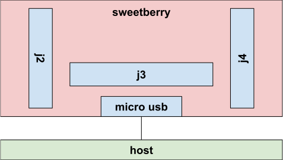

# Sweetberry Configuration

## Requirements

Sweetberry with firmware version sweetberry\_v1.1.8453-11bd4c0f4 or higher

## Background

- physical bank: j2, j3, j4 the white banks physically on the sweetberry board
- i2c port: the i2c port used for a reading
- i2c address: the hex address to use on a given port
- sweetberry config template: .py power template with config\_type='sweetberry'

## Intro

As explained in the README.INA.md file, sweetberry configuration using raw i2c
addresses and ports is difficult. Each physical bank on the sweetberry board is
wired to INAs on different i2c lines (thus using different ports) while some of
those INAs have the same i2c slave address.
Since most use cases in Chrome OS for sweetberry are with a medusa header, the
user is more likely to easily know the physical bank, and the pins.
generate\_ina\_controls.py allows for an alternative configuration using the pin
numbers as a tuple (e.g. (1,3)) and the location variable to be the physical
bank number.
For completeness, please see the conversion table below. It explains how these
values are connected, and can be used to write a sweetberry config template.

## Sweetberry device layout

## Layout of sweetberry configuration

key to interpret pin map:

|  pins  |         j2        |         j3        |         j4        |
|--------|-------------------|-------------------|-------------------|
| xx,xx  | i2c-addr i2c-port | i2c-addr i2c-port | i2c-addr i2c-port |

pin map:

|  pins  |    j2    |    j3    |    j4    |
|--------|----------|----------|----------|
|  1,3   | 0x40  3  | 0x44  3  | 0x48  3  |
|  2,4   | 0x40  1  | 0x44  1  | 0x48  1  |
|  6,8   | 0x40  2  | 0x44  2  | 0x48  2  |
|  7,9   | 0x40  0  | 0x44  0  | 0x48  0  |
| 11,13  | 0x41  3  | 0x45  3  | 0x49  3  |
| 12,14  | 0x41  1  | 0x45  1  | 0x49  1  |
| 16,18  | 0x41  2  | 0x45  2  | 0x49  2  |
| 17,19  | 0x41  0  | 0x45  0  | 0x49  0  |
| 21,23  | 0x42  3  | 0x46  3  | 0x4a  3  |
| 22,24  | 0x42  1  | 0x46  1  | 0x4a  1  |
| 26,28  | 0x42  2  | 0x46  2  | 0x4a  2  |
| 27,29  | 0x42  0  | 0x46  0  | 0x4a  0  |
| 31,33  | 0x43  3  | 0x47  3  | 0x4b  3  |
| 32,34  | 0x43  1  | 0x47  1  | 0x4b  1  |
| 36,38  | 0x43  2  | 0x47  2  | 0x4b  2  |
| 37,39  | 0x43  0  | 0x47  0  | 0x4b  0  |

